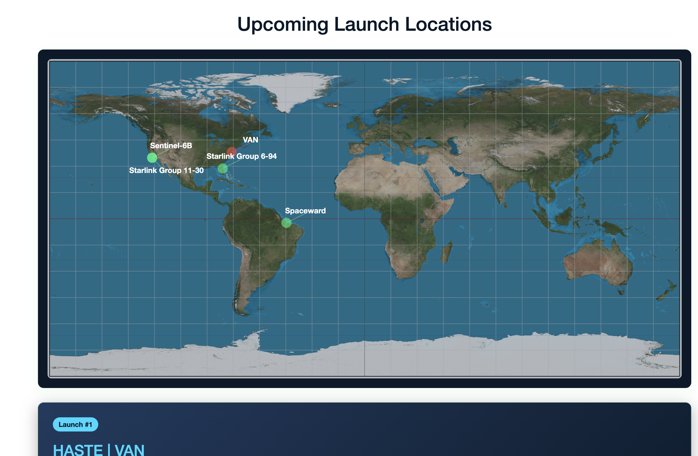
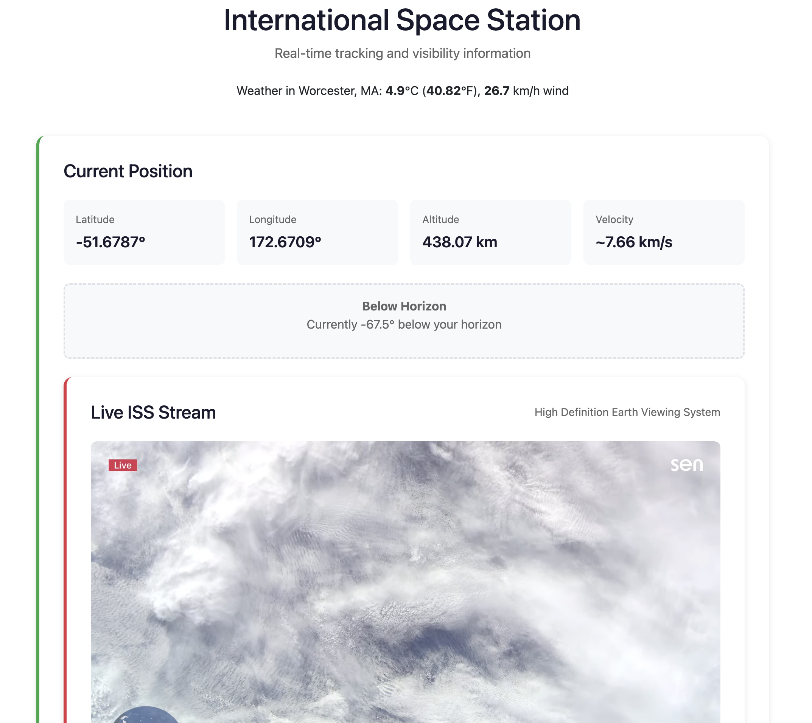
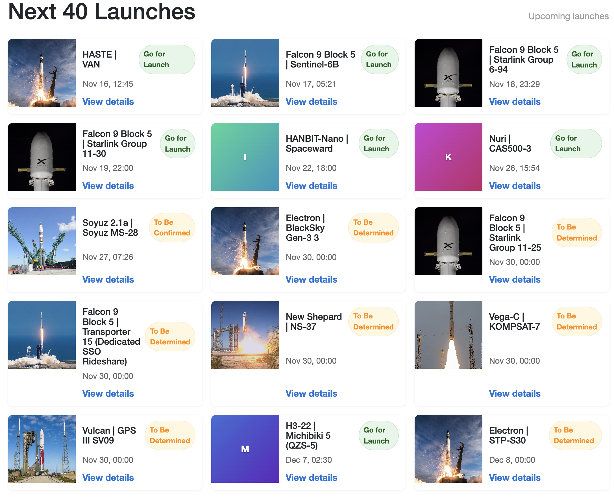
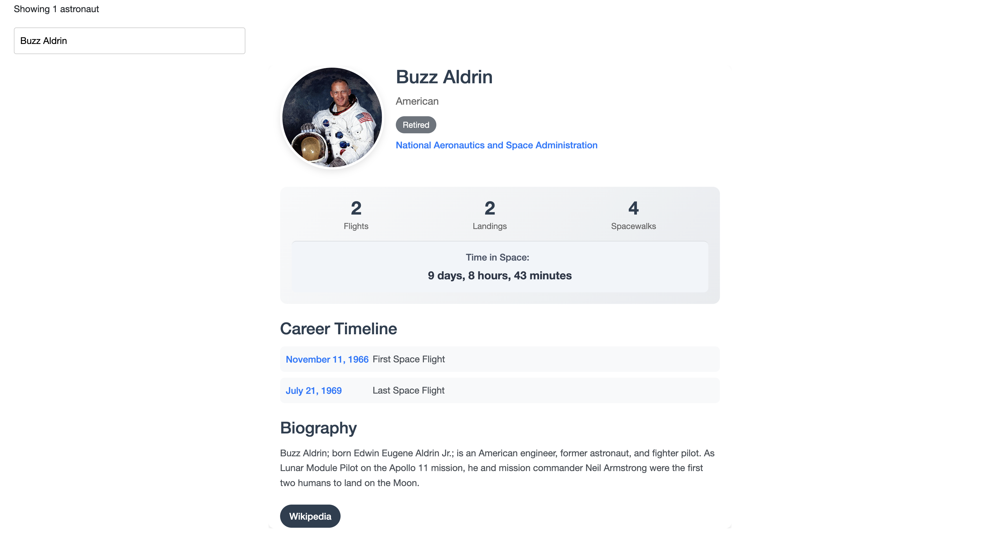
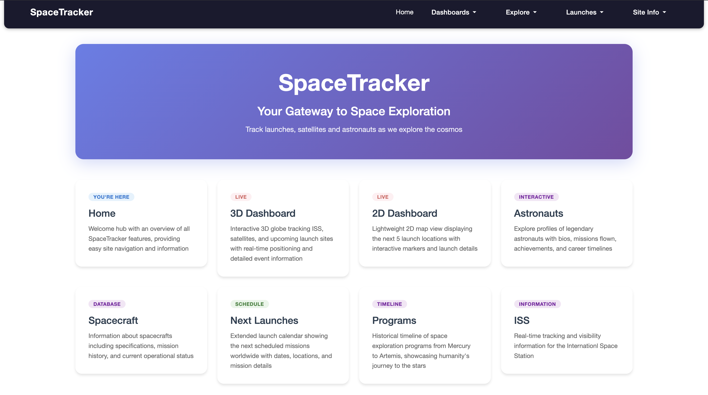
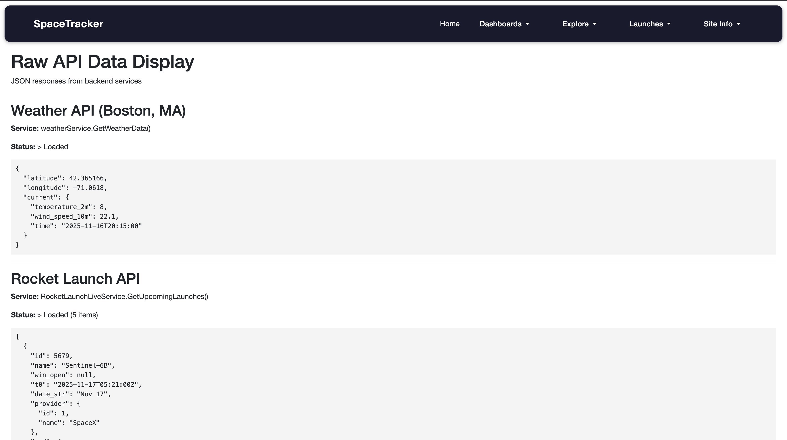
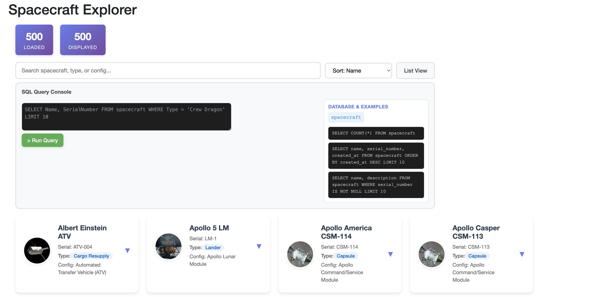

# SpaceTracker

**Your Gateway to Space Exploration**

SpaceTracker is an interactive, data-driven space exploration platform built with **.NET 9**, **Blazor**, **Entity Framework Core**, and **CesiumJS**. It provides real-time tracking of satellites, launches, astronauts, spacecraft, and historical space programs—all powered by multiple live APIs and a locally persisted SQLite database.

---

## APIs Used

- **N2YO API** – ISS position, satellites, passes  
- **SpaceDevs API** – Astronauts, spacecraft, programs  
- **RocketLaunchLive API** – Upcoming launches  
- **OpenMeteo API** – Weather for ISS observer  
- **Space News API** – Space industry news and articles  

---

## Features

- Real-time **ISS tracking** and satellite telemetry  
- Live **launch schedules** and countdown timers  
- Interactive **2D and 3D dashboards** with orbital paths and maps  
- **Astronaut & spacecraft database** with biographies and mission info  
- **Historical program data** and timelines  
- **Space news feed** with articles and industry updates  
- Responsive **Blazor UI** for desktop and mobile  

---

## Screenshots

  
  
  
  
  
  
  
  

---

## Project Structure

```
spaceTracker/
├── BackgroundServices/     # Hosted services (auto-refreshing cached API data)
├── Components/             # Blazor UI components
│   ├── Layout/            # Shared layouts & navigation
│   ├── Pages/             # App pages (ISS, Launches, Astronauts, etc.)
│   ├── Routes.razor       # App routing
│   └── _Imports.razor     # Global using statements
├── Data/                   # EF Core database context and seeders
├── Models/                 # C# models for API responses and structured data
├── Services/               # API service layer for fetching and validating external data
├── wwwroot/                # Static assets (CSS, JS, images)
├── Program.cs              # App bootstrap & dependency injection
├── spaceTracker.csproj     # Project configuration
└── spaceTracker.db         # Local SQLite database
```

---

## Key Pages

| Page | Description |
|------|-------------|
| **Home** | Central hub introducing the project and linking all features |
| **3D Dashboard** | Live Cesium globe with ISS, satellites, and launch sites |
| **2D Dashboard** | Simple 2D map showing upcoming launches |
| **Astronauts** | Database of astronauts with missions and agencies |
| **Spacecraft** | Full spacecraft data including images and details |
| **Launches / BulkLaunches** | Worldwide launch schedules with mission info |
| **Programs** | Historical timeline of space programs |
| **SpaceNews** | Latest space news and industry articles |
| **ISS Page** | Live ISS telemetry, visibility predictions, orbital data |
| **RawData Viewer** | View raw JSON from APIs (N2YO, SpaceDevs, OpenMeteo, RocketLaunchLive) |

---

## Setup Instructions

1. **Clone the repository:**
   ```bash
   git clone <repository-url>
   cd spaceTracker
   ```

2. **Install .NET 9 SDK:**  
   [Download .NET 9](https://dotnet.microsoft.com/download/dotnet/9.0)

3. **Restore dependencies:**
   ```bash
   dotnet restore
   ```

4. **Apply database migrations and seed initial data:**
   ```bash
   dotnet ef database update
   ```

5. **Run the application:**
   ```bash
   dotnet run
   ```

6. **Access the application:**  
   Open your browser and go to `https://localhost:5094` or `http://localhost:5049`.

---

## Dependencies

- .NET 9 SDK
- Blazor Server
- Entity Framework Core (SQLite provider)
- CesiumJS for 3D globe visualization
- Multiple external APIs (N2YO, SpaceDevs, RocketLaunchLive, OpenMeteo, Space News)

---

## Notes

- Ensure an active internet connection for real-time API data.
- The SQLite database persists locally and is automatically seeded with astronauts, spacecraft, and program data.
- Designed for both desktop and mobile users with responsive Blazor components.

---

## Authors

- **Daniel Chavez** – Project Manager, Lead Developer, and Backend Developer
- **Anthony Petrosino** – Full Stack Developer / Blazor UI Developer
- **Jackson Wang** – Frontend / Components & Visuals

---

## License

This project is open-source. See LICENSE for details.

**Archive Notice**: This project is no longer actively maintained as of December 2025. It remains available as a portfolio demonstration and reference implementation. Thank You for viewing.


